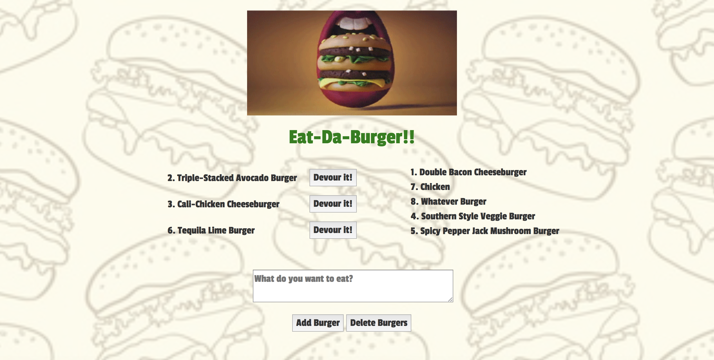

# Eat-Da-Burger

Built as a practice in MySQL and Express, this application stores "burgers" that users submit, and updates the burger status when a burger is "devoured" by a user.

## Tools Used
Express, AJAX, MySQL, JavaSript, jQuery, and Handlebars

## How it Works
User submitted burgers are saved upon creation, and fetched on initial load via AJAX requests to the MySQL database, then rendered via Handlebars. Building this application was great practice in creating an Express server, writing MySQL queries, and using Handlebars.

You can find the app deployed on Heroku in the link below.

https://obscure-castle-75837.herokuapp.com/
